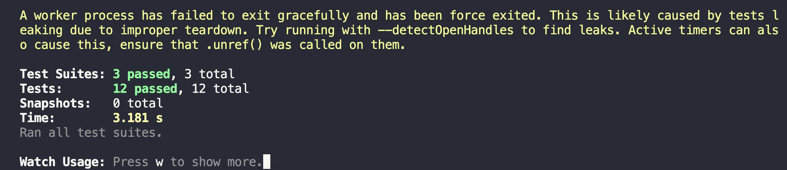

<div align="center">


</div>

## About

This project develops a modern and dynamic web platform using React that allows users to search for detailed information about medicines registered in the United States. To obtain the necessary data, the OpenFDA API will be integrated,

## Source of information

The base data gets from: [The openFDA API](https://open.fda.gov/apis/)

### Build Project

To in install dependencies and build project you can run:

```
npm run build
```

### Run Project

In the project directory, you can run:

```
npm start
```

Runs the app in the development mode.\
Open [http://localhost:3000](http://localhost:3000) to view it in your browser.

### Run test

Run all the test available in ./test folder with this command:

```
npm test
```

All the test will be ok if you can see something like that:

